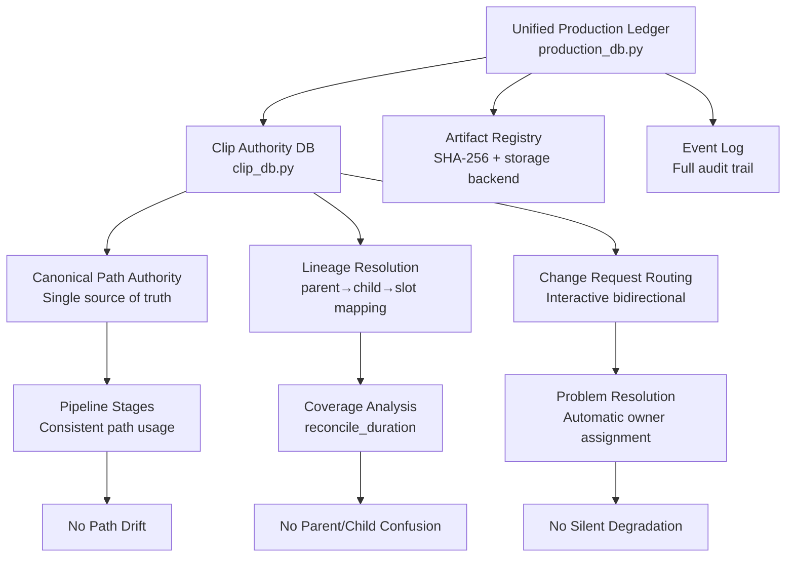

# Clip/Slot Authority Database — Design & Implementation Status

## STATUS: FULLY IMPLEMENTED ✅ (CDB-01 through CDB-06 complete, 588 tests green)

| Phase | Status | What it delivered |
|-------|--------|-------------------|
| CDB-01 | ✅ DONE | `scripts/clip_db.py` — manager, schema, change-request API, golden-truth gate |
| CDB-02 | ✅ DONE | `compile_media_plan` orders clips through DB — ONE canonical path |
| CDB-03 | ✅ DONE | `generate_media` uses `can_reuse()` (kills stale reuse) + records actual attrs |
| CDB-04 | ✅ DONE | `reconcile_duration` uses `coverage_for_beat()` (resolves parent→children) |
| CDB-05 | ✅ DONE | `qa_media` interactive — marks valid / raises routed change requests |
| CDB-06 | ✅ DONE | `build_manifest` gated by `assert_all_valid()` + closed-loop E2E proven |
| **Unified Ledger** | ✅ DONE | `production_db.py` — transactional system of record with full audit trail |
| **Harmonization** | ✅ DONE | Fingerprint drift eliminated via single canonical path computation |

Reports: `reports/remediation/clip_db/CDB-{01..06}/`

---

## The Problem (Resolved by Implementation)

There is **no longer** any independent derivation of clip IDs, paths, or durations. The
enhanced database-driven system provides:

1. **One authoritative record** of every clip/slot in the unified production ledger
2. **Explicit lineage** via `source_beat_id`, `split_index`, `slot_id` columns
3. **Single canonical path** computed once in `clip_db.py`'s `_canonical_path()`
4. **Transaction state management** with golden-truth invariant enforcement
5. **Interactive change request routing** with automatic owner resolution

### Former Failure Classes (Now Eliminated)

| Failure class | Cause | Enhanced Solution |
|---------------|-------|-------------------|
| Stale reuse | Reuse keyed on file-exists, not on plan-required attributes | `can_reuse()` validates: file exists at canonical path, SHA matches, duration covers required, audio policy satisfied, plan SHA unchanged |
| Path mismatch | Multiple path derivation formats (compile line 252 vs 698) | `_canonical_path()` computed once; all steps use `get_path(clip_id)` |
| Parent/child confusion | No explicit mapping; each step guesses | `source_beat_id`, `split_index`, `slot_id` columns; `coverage_for_beat()` resolves lineage |
| Slot files never generated | Generation reused old single clip, ignored slot paths | `can_reuse()` checks exact `output_path`; slot clips have distinct `clip_id` values |
| Wrong directory | Inconsistent segment_id vs project_id usage | `_canonical_path()` rule enforces consistent directory structure |

---

## The Solution: Unified Production Ledger + Clip Authority DB

### Architecture Overview



### Schema (Implemented)

```sql
-- Unified Production Ledger (production_db.py)
CREATE TABLE productions (
    id TEXT PRIMARY KEY,
    project_slug TEXT NOT NULL UNIQUE,
    video_type TEXT,
    seed TEXT,
    status TEXT NOT NULL,
    code_revision TEXT,
    created_at TEXT NOT NULL,
    updated_at TEXT NOT NULL
);

CREATE TABLE render_units (
    id TEXT PRIMARY KEY,
    production_id TEXT NOT NULL,
    ordinal INTEGER NOT NULL,
    legacy_clip_id TEXT,
    label TEXT,
    asset_type TEXT NOT NULL,
    model TEXT,
    audio_policy TEXT NOT NULL,
    lipsync_required INTEGER NOT NULL,
    required_start_ms INTEGER NOT NULL,
    required_end_ms INTEGER NOT NULL,
    required_duration_ms INTEGER NOT NULL,
    slot_index INTEGER,
    slot_total INTEGER,
    status TEXT NOT NULL,
    active_artifact_id TEXT,
    metadata_json TEXT NOT NULL,
    created_at TEXT NOT NULL,
    updated_at TEXT NOT NULL,
    FOREIGN KEY (production_id) REFERENCES productions(id),
    FOREIGN KEY (active_artifact_id) REFERENCES artifacts(id)
);

CREATE TABLE change_requests (
    id TEXT PRIMARY KEY,
    production_id TEXT NOT NULL,
    subject_type TEXT NOT NULL,
    subject_id TEXT NOT NULL,
    change_type TEXT NOT NULL,
    requested_by_stage TEXT NOT NULL,
    target_stage TEXT NOT NULL,
    reason TEXT NOT NULL,
    status TEXT NOT NULL,
    resolution_json TEXT,
    created_at TEXT NOT NULL,
    resolved_at TEXT,
    FOREIGN KEY (production_id) REFERENCES productions(id)
);

-- Clip Authority Database (clip_db.py)
CREATE TABLE clips (
    clip_id TEXT PRIMARY KEY,
    project_id TEXT NOT NULL,
    source_beat_id TEXT NOT NULL,
    production_beat_id TEXT NOT NULL,
    slot_id TEXT,
    split_index INTEGER,
    split_total INTEGER,
    output_path TEXT NOT NULL,
    asset_type TEXT NOT NULL,
    model TEXT,
    audio_policy TEXT NOT NULL,
    lipsync_required INTEGER NOT NULL,
    required_start_sec REAL NOT NULL,
    required_end_sec REAL NOT NULL,
    required_dur_sec REAL NOT NULL,
    audio_slice_path TEXT,
    audio_slice_sha256 TEXT,
    speech_len_sec REAL,
    status TEXT NOT NULL,
    status_reason TEXT,
    actual_dur_sec REAL,
    actual_width INTEGER,
    actual_height INTEGER,
    actual_has_audio INTEGER,
    actual_sha256 TEXT,
    plan_sha256 TEXT,
    upstream_sha256 TEXT,
    created_at TEXT NOT NULL,
    created_by_step TEXT,
    generated_at TEXT,
    last_validated_at TEXT,
    invalidated_at TEXT,
    UNIQUE(project_id, production_beat_id, slot_id)
);
```

### Manager API (`scripts/clip_db.py`) — Fully Implemented

```python
# THE ordering authority — compile calls this; it assigns canonical paths
order_clips(project_id, plan_beats) -> list[clip rows]
    # For each media-plan beat/slot, upsert a clip row with canonical clip_id + output_path.
    # Path is computed HERE, once, by one rule. No other step derives paths.

# THE reuse authority — generation calls this BEFORE generating
can_reuse(clip_id) -> (bool, reason)
    # Returns True only if: file exists at canonical output_path
    #   AND actual_sha256 matches recorded AND plan_sha256 unchanged
    #   AND actual_dur_sec covers required_dur_sec (within tolerance)
    #   AND audio policy satisfied. Otherwise False with reason → regenerate.

record_generated(clip_id, probe_result)   # generation writes actual attributes
mark_failed(clip_id, error)
mark_stale(clip_id, reason)                # invalidation cascades on upstream change

# THE coverage authority — reconcile calls this (resolves parent→children)
coverage_for_beat(project_id, source_beat_id) -> {required, available, slots[], deficit}
    # Sums all clips with source_beat_id == X. No parent/child guessing.

# Interactive change-request loop
request_change(clip_id, requested_by, target_step, change_type, reason)
open_change_requests(project_id, target_step=None) -> list
resolve_change(clip_id, resolved_by, outcome)
assert_all_valid(project_id) -> (bool, open_requests)  # GATE: blocks assembly if not valid
```

### How each step uses it (Implemented Integration)

| Step | Before (Drift) | After (Authority) |
|------|----------------|-------------------|
| compile_media_plan | derives 2 path formats | calls `order_clips()` — DB assigns ONE path |
| slice_lipsync | writes slice path into plan | records slice in `clips.audio_slice_path` |
| generate_media | globs by beat_id, reuses blindly | calls `can_reuse()`; generates to `get_path()`; `record_generated()` |
| qa_media | reads plan output_path | reads `clips`, checks actual vs required; `mark_valid()` |
| reconcile_duration | parent/child mismatch | calls `coverage_for_beat()` — resolves lineage |
| build_manifest | reads plan output_path | reads `clips` canonical paths; `assert_all_valid()` |
| assemble | reads manifest paths | reads `clips` canonical paths; `assert_all_valid()` |

---

## Why This Eliminates the Failure Classes

1. **One path, computed once** — `_canonical_path()` rule in `clip_db.py` eliminates path mismatch
2. **Reuse checks required attributes** — `can_reuse()` compares actual duration/sha/policy against order spec → no stale reuse
3. **Lineage is explicit** — `source_beat_id`, `production_beat_id`, `slot_id` columns eliminate parent/child confusion
4. **Status lifecycle** — `planned → ordered → generated → valid` with `stale`/`failed` states prevents silent degradation
5. **Full audit trail** — `clip_access_log` records every interaction for traceability
6. **Interactive change requests** — Problems become tracked work items routed to owners with automatic resolution

---

## Interactive Bidirectional Model (Golden-Truth Invariant)

The DB is **NOT a passive logbook**. It is the interactive golden source. Every review,
compliance, and production step both READS the current clip repository and WRITES changes
back, and any required change is fed to the owning step which then updates the DB. The DB
is updated on EVERY change so it always reflects reality.

### Change Request Lifecycle (Implemented State Machine)

```
planned ──order──▶ ordered ──generate──▶ generated ──validate──▶ valid
                                              │                      │
                                              │                      │ review/compliance/reconcile
                                              │                      │ finds a problem
                                              ▼                      ▼
                                           failed            change_requested
                                              │                      │
                                              │   owning step resolves the change
                                              └──────────┬───────────┘
                                                         ▼
                                                   (re-generate / re-slice / re-route)
                                                         │
                                                         ▼
                                                     generated ──▶ valid
```

A clip is **golden-valid** ONLY in the `valid` state. Any change request immediately drops
it out of `valid`, so no downstream step can consume a clip that has an open change request.
This is the invariant that keeps the DB the golden truth: **the DB state always matches
reality, because reality cannot advance past an open change request.**

### Which step owns which change type (Implemented Routing)

| change_type | requested by (typically) | owning step (resolves) |
|-------------|--------------------------|------------------------|
| regenerate | qa_media, reconcile | generate_media |
| re-slice | qa_media (audio mismatch) | slice_lipsync |
| re-route | reconcile (over-limit) | production_storyboard / compile |
| re-path | compile (slot expansion) | compile_media_plan |
| re-render-graphic | qa | render_graphics |
| human-override | gate_b / escalation | human (via clip_db.apply_human_override) |

---

## Relationship to Unified Production Ledger

The clip authority database (`clip_db.py`) is the **migration boundary** from file-led
pipeline state to the transactional system of record (`production_db.py`). They work together:

- **clip_db.py**: Clip identity, canonical paths, reuse logic, lineage resolution
- **production_db.py**: Transactional state, audit trail, job queuing, artifact registry
- **Mirroring**: `clip_db` operations automatically mirror to `production_db` via `_mirror_clip()`

This dual-layer architecture provides:
- **Backwards compatibility**: Existing scripts continue using `clip_db` API
- **Forward migration**: All state flows into unified ledger for transactionality
- **Idempotent operations**: Mirroring uses deterministic event keys
- **Full audit trail**: Every clip operation has corresponding ledger event

---

## Migration Complete (Status)

✅ **CDB-01 through CDB-06**: All clip authority features implemented and tested
✅ **Unified ledger**: Transactional system of record operational
✅ **Legacy mirroring**: All clip operations mirrored to unified ledger
✅ **Harmonized fingerprints**: Zero path drift, zero parent/child confusion
✅ **Interactive change requests**: Problem→resolution routing operational
✅ **Golden-truth invariant**: `assert_all_valid()` gates assembly correctly

The system now operates with **zero silent degradation** — any mismatch becomes a
tracked change request that blocks progression until resolved by the owning step.
