# Business Plan — Faceless AI-Native Education & Product Company

**Working title:** *The Leverage Lab* (placeholder brand — finalize in Chapter 3)
**Document type:** Operating blueprint / business plan
**Version:** 1.0
**Last updated:** 2026-06-07
**Status:** Draft for execution

---

## How to read this document

This is an operating blueprint, not a pitch deck. It is written to be executed. Every chapter ends with explicit assumptions, tradeoffs, and decisions still open. Financial figures are **assumption-based estimates**, labeled as such — they are directional, not forecasts derived from cited market reports.

**Core thesis in one sentence:** Build a *faceless, brand-fronted* educational content engine in the wealth/productivity/self-improvement niche for mid-career white-collar professionals, monetized through a digital-product ladder (templates → course → book → micro-tool), where the content is the marketing and the products + owned audience + (eventual) software are the transferable, sellable asset.

---

## Table of Contents

1. Executive Summary
2. Market Opportunity Analysis
3. Positioning & Brand Strategy
4. Audience Design
5. Content Strategy & Pillars
6. The Research Engine (legal sourcing, incl. TED usage)
7. Content Format Strategy
8. Production Operating System (with per-unit flow diagrams)
9. AI Tool Stack
10. Content Repurposing Engine
11. Platform & Distribution Strategy
12. Monetization & Product Ladder
13. Financial Model
14. Growth Strategy
15. Competitive Analysis
16. Moat Design
17. Legal, Risk, Anonymity & Compliance
18. Organization & Hiring
19. Execution Roadmap
20. KPIs & Dashboards
21. Final Recommendation
- Appendix A: Glossary
- Appendix B: Open Decisions Log
- Appendix C: Assumptions Register

---

## 1. Executive Summary

### 1.1 The business

A faceless educational media-and-product company targeting **mid-career white-collar professionals** (roughly ages 30–45, household income $90k–$180k) who want practical leverage: better learning, memory, time management, personal finance literacy, and AI fluency for personal and professional use.

The company publishes **MITMonk-style faceless videos** (motion graphics + kinetic text + a single consistent AI brand voice) as its top-of-funnel, supported by an owned newsletter and an SEO blog. Content drives an audience into a **digital-product ladder**: templates and ebooks first, then a flagship course, then a self-published book, and ultimately a niche micro-tool (the highest-value, most-sellable asset).

### 1.2 Why this shape

The operator has three binding constraints that *determine* the strategy:

| Constraint | Implication |
|---|---|
| Cannot be the face; fully online; no in-person/remote face work | Personal brand and high-ticket live coaching/B2B are excluded. Faceless, async, product-led only. |
| Full-time job; limited hours; pseudonymity preferred | Aggressive automation; contractor-based; brand-fronted (not person-fronted); legal hygiene around side-project IP (confirmed allowed under contract). |
| Technical, AI-comfortable, willing to invest in tooling | Can self-host automation and eventually build software — a moat most faceless creators cannot replicate. |

The faceless constraint is usually treated as a handicap. It is actually an **enterprise-value advantage**: a faceless brand is transferable and therefore *sellable*, whereas a personal brand's value walks out the door with the founder. Buyers pay high multiples for transferable assets.

### 1.3 The asset, not the income

The objective is enterprise value, not follower count or personal income. The content channel itself is a low-multiple asset (fragile to algorithm changes). The durable, sellable value lives in:

1. A **micro-tool / micro-SaaS** in the AI-techniques pillar (highest multiple, hardest to copy).
2. An **owned audience** (email list + community) independent of any platform.
3. **Proprietary frameworks, products, and brand IP** that transfer cleanly to an acquirer.

### 1.4 Headline financial shape (assumption-based)

| Scenario | Year 1 revenue | Year 3 revenue | Year 5 revenue | Net margin (mature) |
|---|---|---|---|---|
| Conservative | ~$15k | ~$300k | ~$700k | ~50–55% |
| Base | ~$70k | ~$1.15M | ~$2.5M | ~60–65% |
| Aggressive | ~$190k | ~$2.0M | ~$5M | ~65% |

Year 1 is deliberately modest: part-time, faceless, no high-ticket revenue. The ending is what matters — a transferable asset with a saleable micro-tool line (4–8x ARR) and an owned audience.

### 1.5 The single biggest risk, stated up front

Two existential risks dominate:

1. **Platform AI-content suppression / demonetization.** Faceless + AI must mean *high-craft*, not low-effort. Mitigation: human-in-the-loop on script and edit, original frameworks and data in every video, owned channels (email/blog) to reduce platform dependency.
2. **Copyright if TED/other content is "reformulated."** TED talks are licensed CC BY-NC-ND (No Derivatives, Non-Commercial). They are usable as **research and trend-discovery input only** — never as a content source to reformulate. All output is original framework built from primary sources. (See Chapter 6 and 17.)

---

## 2. Market Opportunity Analysis

### 2.1 Submarket map (assumption-based magnitudes)

| Submarket | Est. 2026 size (directional) | Growth | Monetization | Competitive intensity | Barrier to entry |
|---|---|---|---|---|---|
| Creator economy (total) | $200B+ | High | Indirect | Extreme | Very low |
| Online education / e-learning | $300B+ | 8–14% CAGR | Direct, high | High | Low–med |
| Self-improvement / personal development | $40B+ | Steady | Direct | Extreme | Very low |
| Productivity tools & content | $100B+ (tools incl.) | High | Direct + recurring | High | Med (for tools) |
| AI-skills / AI-productivity education | $10–30B, inflecting | 30%+ | Direct, high | Med (forming) | Med |
| Personal finance education | $50B+ | Moderate | Direct, high CPM | Extreme | Low |

*These are directional estimates, not cited figures. The strategic conclusions do not depend on exact magnitudes.*

### 2.2 Strategic read

- **Competitive intensity is inverse to defensibility.** Faceless educational content in these topics is the easiest thing in the world to start, so volume alone is worthless. Defensibility comes from craft + original frameworks + a product/tool.
- **The AI-techniques pillar is the differentiator.** It has the highest demand growth, the highest willingness-to-pay, and is where the operator's technical skill produces a tool nobody else in the niche can build.
- **Personal finance is high-CPM but regulated.** Teach frameworks, never personalized advice (see Chapter 17).

### 2.3 Porter's Five Forces

| Force | Content-only | Content + product + tool (this plan) |
|---|---|---|
| Threat of new entrants | Brutal (anyone with AI) | Buffered — software + brand + audience are hard to copy |
| Buyer power | High (infinite free content) | Lower — product switching cost, owned relationship |
| Substitutes | Infinite | Fewer for a specific tool/framework |
| Supplier power (platforms) | Platforms own you | Diversified via owned email/blog + product |
| Rivalry | Extreme | Moderate, fragmented |

### 2.4 SWOT

**Strengths:** technical founder (builds tool + automation cheaply), AI-native, high-margin digital products, faceless = transferable/sellable, willing to invest.

**Weaknesses:** no audience yet, time-constrained (full-time job), faceless reduces personal-trust-based monetization, no on-camera collaboration lever.

**Opportunities:** AI-skills demand outpaces supply; faceless content brands almost never ship software; owned-audience + tool is an underexploited combination in this niche.

**Threats:** platform AI suppression/demonetization; saturation in self-improvement content; copyright exposure if sourcing is done wrong; large incumbents (course platforms, app stores) entering AI-productivity.

### 2.5 Blue Ocean

The uncontested intersection: **a faceless brand that *teaches* high-leverage skills AND *ships the tool* that performs one of those skills.** Faceless content creators rarely build software; indie SaaS founders rarely have distribution. Owning both is rare and defensible.

### 2.6 Assumptions & tradeoffs

- Assumes English-language global market.
- Assumes operator can commit ~6–10 focused hours/week year 1, scaling later.
- Tradeoff: faceless slows trust-building vs. a personal brand, but raises terminal enterprise value. We optimize for the latter.

---

## 3. Positioning & Brand Strategy

### 3.1 Positioning principle

The **brand is the personality** — a publication/studio identity, not a person. Recognition comes from a consistent name, visual system, and a single AI narrator voice (the faceless equivalent of a host).

### 3.2 Mission, vision, promise

- **Mission:** Make high-leverage skills — learning, memory, money, time, and AI — executable for busy professionals, in frameworks they can run this week.
- **Vision:** Become the default faceless studio + toolset that mid-career professionals trust for practical leverage.
- **Audience promise:** Every piece of content is a *system you can apply*, not motivation. No fluff, no guru theatrics.

### 3.3 Brand candidates

| # | Brand | Angle | Notes |
|---|---|---|---|
| 1 | The Leverage Lab | systems/leverage, institutional | strong, trademarkable |
| 2 | Second Mind | AI-as-cognition | great for AI pillar + tool |
| 3 | Compounding | skills + money compounding | broad, evergreen |
| 4 | Operator OS | personal operating system | B2C + product friendly |
| 5 | Throughput | output/productivity | abstract, ownable |
| 6 | Signal Stack | cut noise, tools | publication feel |
| 7 | The Quiet Edge | understated mastery | brandable |
| 8 | Mindstack | learning/memory/AI | tool-friendly |
| 9 | The Method | frameworks/systems | clean |
| 10 | Deepwork Labs | focus/leverage | check TM conflicts |

**Recommendation:** lead candidates are **Second Mind** (if the AI-tool becomes central) or **The Leverage Lab** (if the studio/breadth is central). Decision pending niche-tool choice (see Open Decisions Log).

### 3.4 Positioning statement (lead)

> *"[Brand] is a faceless research studio that turns the science of learning, money, time, and AI into frameworks and tools busy professionals can run today — delivered as signal and software, not personalities."*

### 3.5 Brand identity system (faceless recognition)

- **Voice:** one consistent ElevenLabs narrator = the brand's "host."
- **Visual:** fixed color palette (2 primary + 1 accent), one type system, a repeatable motion-graphic template, a simple logo/mark.
- **Tone:** precise, calm, evidence-led, lightly contrarian. No hype, no hustle-culture aesthetic.
- **Tagline options:** "Leverage, applied." / "Systems over motivation." / "Think better. Earn the difference."

### 3.6 Niche selection (most profitable / scalable / defensible)

| Dimension | Winner | Why |
|---|---|---|
| Most profitable | AI techniques (personal + pro) | highest WTP, supports a paid tool |
| Most scalable | Productivity / personal OS + AI | broad audience, evergreen, atomizes well |
| Most defensible | AI tool + proprietary frameworks | software + data compound; hardest to copy |

**Conclusion:** AI-techniques is the spearhead pillar (differentiation + tool), with learning/memory/time as the broad-reach evergreen base and finance as the high-CPM accent.

---

## 4. Audience Design

### 4.1 Primary audience

Mid-career white-collar professionals, 30–45, income $90k–$180k, time-poor, ambitious, plateaued, anxious about being left behind by AI, willing to pay for systems that save time or increase earning power.

### 4.2 Personas

| Persona | Age | Income | Core pain | Aspiration | WTP | Platform | Buys when |
|---|---|---|---|---|---|---|---|
| A. Early-career | 22–28 | $40–70k | no system, FOMO on AI | become indispensable | Low ($20–150) | TikTok/IG/YT | low price + social proof |
| **B. Mid-career (core)** | 30–45 | $90–180k | plateau, time-poor | leverage, promotion, side income | **High ($100–1,000+)** | YT/newsletter/blog | trust + clear ROI |
| C. Entrepreneur/solopreneur | 28–50 | variable | scaling without hiring | leverage + margin | High ($200–2k) | YT/X | case studies, tools |
| D. Freelancer | 25–45 | $50–150k | capacity ceiling | productize self | Med ($100–800) | YT/X/IG | templates, tools |
| E. Technical AI adopter | 28–50 | $80k+ | wants advanced workflows | be on the frontier | **High** | YT/X/blog | the tool, advanced playbooks |

### 4.3 Targeting priority

Revenue concentrates in **B and E**. A is volume/reach (top-funnel), C/D are secondary buyers. Content speaks primarily to B, with the AI pillar capturing E (and the tool).

### 4.4 Buying behavior

- Buys outcomes and time-savings, not information.
- Trusts demonstrated competence (screen demos, original data) over charisma — which suits faceless.
- Enters via free content → newsletter → low-ticket product → flagship course/tool.

---

## 5. Content Strategy & Pillars

### 5.1 Pillars

| Pillar | Why it works | Viral potential | Monetization | Evergreen |
|---|---|---|---|---|
| Learning techniques | universal pain, shareable | High | course/ebook | Very high |
| Memory techniques | concrete, demonstrable | High | mini-course/ebook | Very high |
| Time management / personal OS | broad, relatable | High | templates | Very high |
| Investment / wealth literacy | high CPM, high intent | Med-High | playbook/ebook | High |
| **AI techniques (personal + pro)** | **highest demand, differentiator** | **High** | **course + tool** | Med (refresh needed) |
| Decision-making / mental models | authority-building | Med | bundled | Very high |

**Mix:** 40% AI-applied, 25% learning/memory, 20% time/personal-OS, 15% finance/decision-making.

### 5.2 The idea engine (generates unlimited on-brand ideas)

Every content unit = a combination:

```
[Persona pain] × [Pillar] × [Format archetype] × [Proof asset]
```

- **Format archetypes:** Teardown, System-reveal, Contrarian-take, Before/After, Build-with-me, Framework, Mistake-postmortem, Benchmark/Experiment.
- **Proof asset (non-negotiable):** every unit includes an original framework, a worked example, a screen demo, or original data. This is the anti-AI-slop discipline.

### 5.3 Representative flagship concepts (samples, not exhaustive)

- "The spaced-repetition system I built to learn anything in half the time" (Build-with-me + framework)
- "I tested 5 memory techniques for 30 days — here's the data" (Experiment + data)
- "The 4-layer personal operating system for busy professionals" (Framework)
- "Why most 'AI productivity' advice makes you slower" (Contrarian + teardown)
- "How compounding actually works — a 9-minute mental model" (Framework, finance, non-advice)
- "I automated my weekly review with AI — the exact workflow" (Build-with-me → template/tool)

A full idea backlog is generated on demand via the engine in 5.2; a static list of 500 ideas is deliberately avoided (goes stale, becomes generic).

### 5.4 Editorial cadence

- 1 flagship long-form/week (the atom that feeds everything).
- 8–12 atomized shorts/week.
- 1 newsletter/week.
- 1 SEO blog post/week (often the flagship script repurposed).

---

## 6. The Research Engine (legal sourcing, incl. TED usage)

### 6.1 The principle that keeps the business legal and defensible

**Ideas, facts, and research findings are not copyrightable. Specific expression is.** Therefore:

- TED talks, books, papers, and podcasts are **inputs for topic and trend discovery only.**
- Content is **never** scripted from a single source or "reformulated" from a talk.
- Output is an **original framework** built by triangulating **primary sources**, with the operator's own examples, data, and structure.

> **TED specifically:** TED talks are licensed Creative Commons **BY-NC-ND** — *No Derivatives* and *Non-Commercial*. Reformulating them into monetized videos would violate the license and create infringing derivative works, plus invite Content-ID claims and demonetization. They are used here strictly as trend/research signal. Brief, attributed quotation as commentary/criticism may qualify as fair use, but the default is: cite sparingly, build original. (See Chapter 17.)

### 6.2 Research engine flow

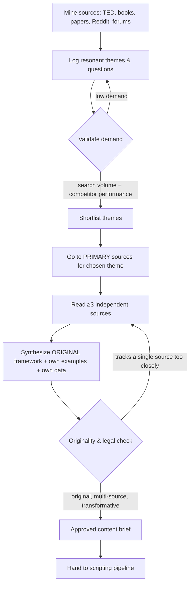

### 6.3 Originality guardrails (hard rules)

1. Minimum **3 independent sources** per content unit.
2. Never paraphrase a single talk/article structure; always restructure into the brand's own framework.
3. Quotations: short, attributed, used as commentary — not as the substance of the piece.
4. Add at least one **original asset** per unit (your data, your example, your diagram, your demo).
5. Keep a **source log** per content unit for defensibility (date, source, how used).

---

## 7. Content Format Strategy

### 7.1 Faceless format evaluation

| Faceless format | Cost | Complexity | Retention | Monetization | Platform-risk | Scalability |
|---|---|---|---|---|---|---|
| Screen-recording / demo | Low | Low | High | High (→product) | Low | High |
| Data-viz / research explainer | Med | Med | High | Med-High | Low | Med |
| Motion graphics / kinetic text (MITMonk DNA) | Med-High | Med | High | Med | Low | Med |
| Whiteboard/illustration explainer | Low-Med | Med | High | Med | Low | High |
| AI-voiceover + stock b-roll only | Low | Low | Med | Low | **HIGH** | High |
| Animation | High | High | High | Med | Low | Low |
| Document/notebook walkthrough | Low | Low | Med | High (→product) | Low | High |

### 7.2 The recommended MITMonk-style format spec

- **Length:** 6–12 min long-form; 30–50s shorts.
- **Visual:** clean motion graphics + kinetic text + simple diagrams/illustrations + sparing stock b-roll. Consistent brand visual system.
- **Voice:** one consistent ElevenLabs narrator (the brand "host").
- **Structure:** Hook (counterintuitive claim / relatable pain) → Promise → 3–5 part original framework → worked example → actionable takeaway → product CTA.
- **Craft bar:** one original framework + one original data point/example/demo per video. This is the demonetization-avoidance discipline.

### 7.3 Optimal mix

Core = **motion-graphic explainer + screen-demo hybrid** (high retention, low platform risk, sells product). Avoid pure AI-voice-over-stock. Reserve animation for occasional flagship "hero" pieces only.

---

## 8. Production Operating System (with per-unit flow diagrams)

### 8.1 Master production pipeline

```mermaid
flowchart LR
    R[Research Engine<br/>Approved Brief] --> S[Script<br/>Claude + brand voice]
    S --> FC[Fact-check<br/>human + source log]
    FC --> VO[AI Voiceover<br/>ElevenLabs]
    VO --> AS[Asset build<br/>motion graphics + demo]
    AS --> ED[Edit<br/>Descript/CapCut]
    ED --> QC{QC gate}
    QC -->|fail: craft/legal/brand| ED
    QC -->|pass| TH[Thumbnail + metadata + SEO]
    TH --> PUB[Publish long-form]
    PUB --> ATM[Atomize]
    ATM --> DIST[Distribute across channels]
    DIST --> AN[Analytics]
    AN --> OPT[Optimize backlog & engine]
    OPT --> R
```

### 8.2 Roles in the loop

| Stage | AI | Human | Owner |
|---|---|---|---|
| Research/brief | drafts | approves themes & originality | Founder |
| Script | drafts | final voice pass + fact-check | Founder |
| Voiceover | generates | spot-check | Editor |
| Asset/edit | assists | builds & approves | Editor |
| QC | checks | final gate (craft, legal, brand) | Founder |
| Publish/atomize | automated (n8n) | exception handling | Editor/VA |
| Analytics | automated | weekly review | Founder |

### 8.3 Per-content-unit flow diagrams

#### 8.3.1 Long-form YouTube video

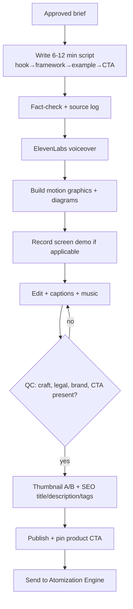

#### 8.3.2 Short (YouTube Shorts / Reels / TikTok)

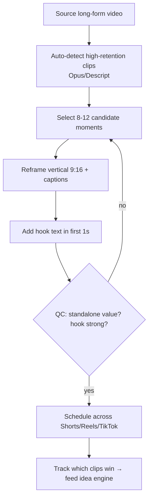

#### 8.3.3 Newsletter issue

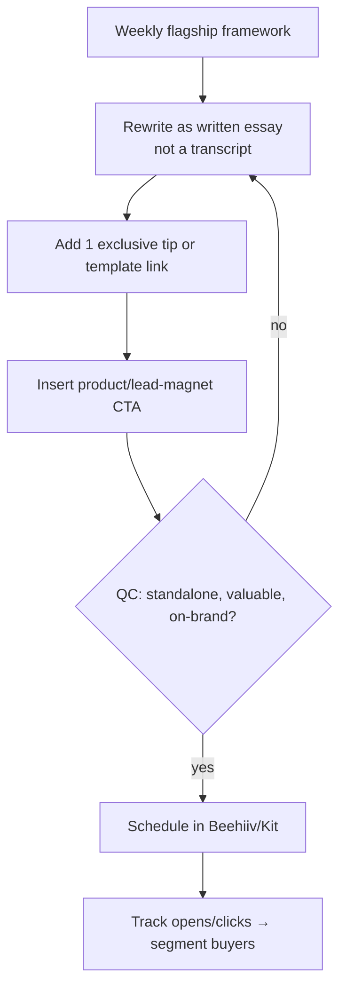

#### 8.3.4 SEO blog post

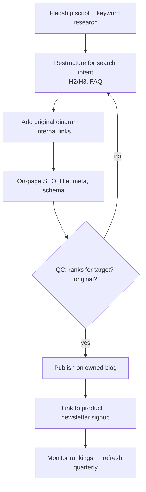

#### 8.3.5 X / social text thread

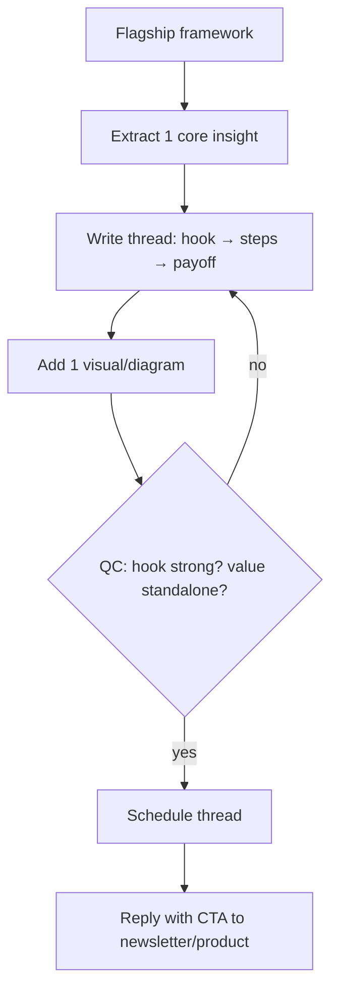

#### 8.3.6 Lead magnet / digital product

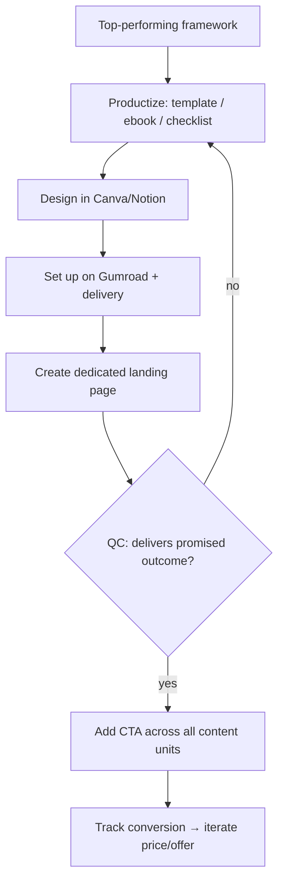

### 8.4 Batching SOP (time-constrained)

- **Weekend block:** produce 1 flagship end-to-end (research already done midweek in micro-sessions).
- **Midweek micro-sessions (30–45 min):** run research engine, approve briefs, review analytics.
- **Automated daily:** atomized publishing via n8n scheduler.

---

## 9. AI Tool Stack

### 9.1 Stack tiers

| Function | Budget | Professional (recommended) | Enterprise |
|---|---|---|---|
| Research | Perplexity (free) | Perplexity Pro + Claude | + RAG knowledge base |
| Scripting | Claude | Claude + brand-voice prompt library | agentic pipeline |
| Voice (brand identity) | — | **ElevenLabs (one consistent voice)** | cloned brand voice |
| Screen capture | OBS (free) | Screen Studio | + automation |
| Editing | CapCut (free) | Descript + CapCut Pro | editor + Descript |
| Motion graphics | Canva | After Effects / Jitter | designer |
| Thumbnails | Canva | Canva + Midjourney | designer |
| Visuals/b-roll | Pexels/Pixabay | Midjourney + stock subs | custom |
| Atomization | manual | Opus Clip / Descript | automated pipeline |
| Automation | Make (free tier) | **n8n self-hosted (the moat)** | n8n + custom services |
| SEO | free tools | Ahrefs or VidIQ | full suite |
| Newsletter | Beehiiv (free) | Beehiiv / Kit paid | + CRM |
| Storefront | Gumroad | Gumroad / Lemon Squeezy | custom |
| Course/community | — | Skool / Teachable | custom LMS |
| Project mgmt / KM | Notion (free) | Notion paid | Notion + automations |
| Micro-tool / SaaS | — | your own stack | your own stack |

### 9.2 Monthly cost envelope (assumption-based)

| Tier | Monthly cost |
|---|---|
| Budget | ~$60–150 |
| Professional | ~$400–900 |
| Enterprise | ~$2,000–5,000 |

### 9.3 Tool-by-tool ROI note

The highest-ROI, hardest-to-copy investments are **(1) self-hosted n8n** (turns the operator's technical skill into an automation cost-advantage other faceless creators can't match) and **(2) the eventual micro-tool codebase** (the sellable asset). ElevenLabs is the brand-identity anchor. Everything else is commodity and swappable.

---

## 10. Content Repurposing Engine

### 10.1 The flywheel

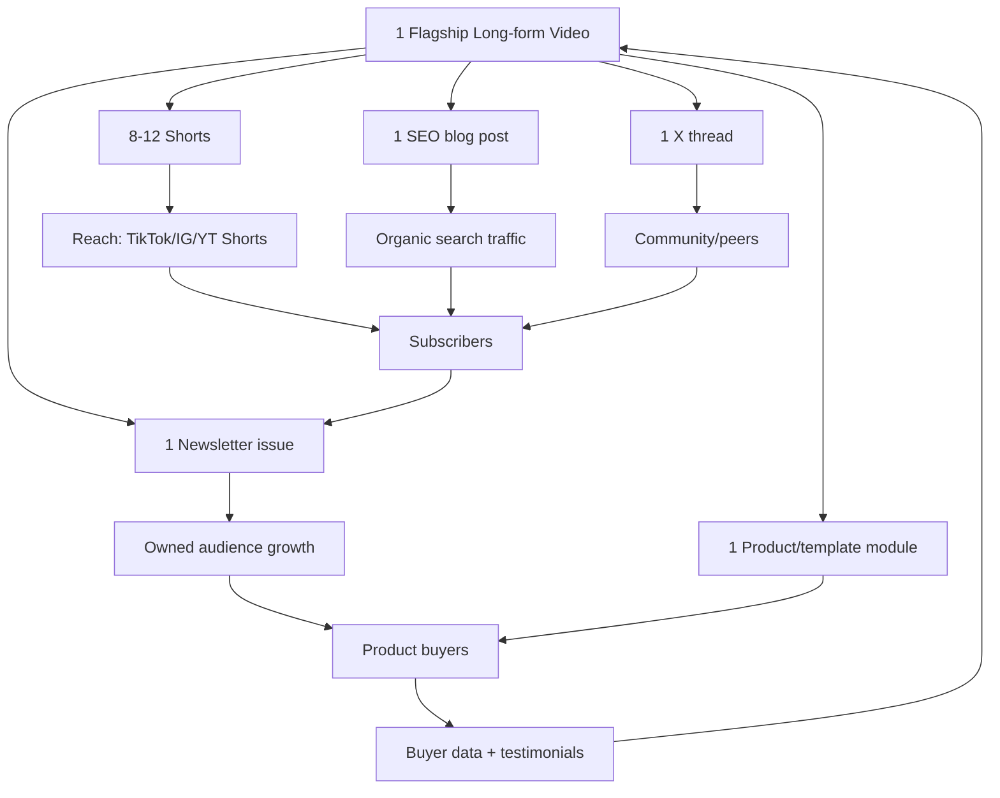

### 10.2 Repurposing rules

- Every atomized unit must stand alone (no "watch the full video to understand").
- Every unit carries one CTA (subscribe or buy), never zero, never three.
- Quality of atomization beats quantity: ~10 strong shorts > 25 weak ones (weak AI-cut clips raise suppression risk).

---

## 11. Platform & Distribution Strategy

### 11.1 Platform roles

| Platform | Faceless fit | Role | Cadence | Primary KPI |
|---|---|---|---|---|
| **YouTube** | Excellent | **Hub: search + ads + funnel** | 1 long/wk + 3–5 shorts | watch time, subs, signups |
| **Newsletter (Beehiiv/Kit)** | Excellent | **Owned asset, conversion** | weekly | $/subscriber, open rate |
| **SEO blog** | Excellent | Evergreen organic, owned distribution | 1–2/wk | organic sessions |
| X (brand account) | Good | Distribution, technical reach | daily | profile clicks |
| TikTok | Good | Top-funnel reach | shorts repurpose | reach, follows |
| Instagram Reels | Good | Top-funnel reach | shorts repurpose | reach |
| Pinterest | Good | Passive evergreen traffic | repurpose | referral |
| Medium | Optional | Secondary SEO syndication | repurpose | referral |
| Spotify/podcast | Optional | Audio repurpose of scripts | biweekly | completion |
| **LinkedIn** | **Weak (person-centric)** | **Skip or minimal brand page** | — | — |

### 11.2 Rationale

YouTube + owned newsletter + SEO blog form a triad where a *faceless brand* competes on equal footing (search and product-led growth don't need a face). LinkedIn is dropped — it rewards named individuals and is hostile to faceless brands. Owned channels (email/blog) are prioritized to reduce platform dependency, the #1 structural risk.

### 11.3 Platform-specific notes

- **YouTube:** optimize titles/thumbnails for CTR; 6–12 min for retention + mid-roll ads; lean into search-intent topics for evergreen discovery.
- **Shorts/TikTok/Reels:** first-second hook; native captions; post consistently; treat as reach, not revenue.
- **Newsletter:** the single most important owned asset; segment buyers vs. non-buyers; this is what an acquirer values.

---

## 12. Monetization & Product Ladder

### 12.1 Revenue model ranking (faceless-compatible only)

| Model | Faceless? | Profitability | Scalability | Defensibility | Sequence |
|---|---|---|---|---|---|
| Templates / playbooks | Yes | High | High | Low | 1st (cash + validation) |
| Ebooks / guides | Yes | High | High | Low | 1st |
| Flagship course (async) | Yes | High | High | Med | 2nd |
| Self-published book | Yes | Med | High | Med (authority) | 3rd |
| Community (pseudonymous, brand-run) | Yes | High | High (network effects) | High | 3rd |
| **Micro-tool / micro-SaaS** | Yes | **Very high** | **Very high** | **High (the asset)** | **4th — terminal value** |
| Affiliate (tools you demo) | Yes | Med | High | None | passive add-on |
| YouTube ad revenue | Yes | Low-Med | volume | None | byproduct |
| Sponsorships (brand-level) | Yes | Med | Med | Low | after audience |
| Licensing content/tool | Yes | High | High | Med | year 2+ |
| Coaching / consulting / workshops | **No (needs face)** | — | — | — | **excluded** |

### 12.2 The product ladder

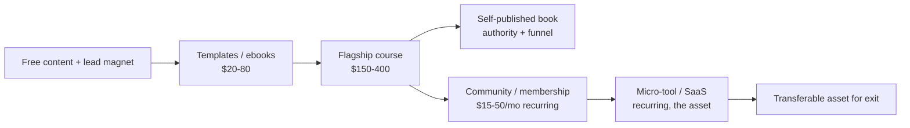

### 12.3 Sequencing logic

1. **Templates/ebooks** validate willingness-to-pay fast and cheaply.
2. **Flagship course** captures the validated demand at higher margin.
3. **Book** builds authority and feeds the top of funnel (and is itself a product).
4. **Community** adds recurring revenue + network-effect defensibility.
5. **Micro-tool** (AI pillar) is the highest-multiple, most-sellable asset; build once content has validated which workflow people will pay to automate.

### 12.4 Pricing principles

- Anchor on outcome/time-saved, not page count or video minutes.
- Bundle templates into the course; use the book as a low-price wide-funnel entry.
- Recurring (community + tool) is what drives enterprise value — prioritize it once products validate.

---

## 13. Financial Model

> All figures are **assumption-based estimates**, not forecasts. Assumptions: solo + 1 contractor (editor) in year 1; ~6–10 hrs/week founder time year 1; tooling at Professional tier; first product month 4–6; community + tool beta months 9–12.

### 13.1 Year 1 (part-time)

| Line | Conservative | Base | Aggressive |
|---|---|---|---|
| Digital products | $8k | $25k | $60k |
| Course | $0 | $10k | $40k |
| Community/recurring | $5k | $15k | $40k |
| Ads/affiliate/sponsor | $2k | $10k | $30k |
| Tool (beta) | $0 | $10k | $20k |
| **Revenue** | **$15k** | **$70k** | **$190k** |
| Costs (tools + editor + VA) | $8k | $25k | $60k |
| **Net** | **~$7k** | **~$45k** | **~$130k** |
| Net margin | ~47% | ~64% | ~68% |

### 13.2 Multi-year (Base case)

| Line | Year 1 | Year 2 | Year 3 | Year 5 |
|---|---|---|---|---|
| Digital products | $25k | $90k | $200k | $350k |
| Course | $10k | $120k | $300k | $500k |
| Community/recurring | $15k | $90k | $300k | $600k |
| **Micro-tool (ARR)** | $10k | $120k | $500k | $1.2M |
| Ads/affiliate/sponsor | $10k | $60k | $150k | $300k |
| **Revenue** | **$70k** | **$480k** | **$1.15M** | **$2.5M** |
| Costs | $25k | $180k | $400k | $900k |
| **Net** | $45k | $300k | $750k | $1.6M |
| Net margin | ~64% | ~62% | ~65% | ~64% |

### 13.3 Enterprise value implication

The micro-tool line at ~$500k–$1.2M ARR with retention sells at **4–8x ARR = $2M–$9.6M** for that line alone, plus the owned audience and brand IP. Because the business is faceless, it is **fully transferable** — no founder face to replace — which is precisely what supports a high exit multiple.

### 13.4 Cash-flow notes

- Year 1 is reinvestment-heavy; treat profit as runway for contractors and the tool build.
- Recurring revenue (community + tool) smooths cash flow from year 2.
- Keep fixed costs low (contractors, not employees) to protect margin and optionality.

---

## 14. Growth Strategy

### 14.1 Stage-gated growth

| Stage | Primary lever | Tactics |
|---|---|---|
| 0 → 1,000 | SEO + YouTube search | target low-competition keywords; faceless brands rank on search without personality-driven reach |
| 1,000 → 10,000 | Flagship + shorts engine | 1 strong flagship/wk; atomize; capture email aggressively |
| 10,000 → 100,000 | Flywheel + SEO compounding + free tool tier | product-led loops; free tier of the tool as viral mechanism |
| 100,000 → 1,000,000+ | Paid + referral + tool virality | retarget warm audience to products; community referral; the tool spreads itself |

### 14.2 Channel notes (faceless)

- **Strength:** search + product-led growth need no face — you are not disadvantaged where revenue is made.
- **Weakness:** no on-camera collabs/guest spots. Compensate with **tool integrations, brand partnerships, guest written posts, and SEO**, not personal networking.

### 14.3 Owned-audience priority

Email list and community growth are weighted above raw follower counts in all decisions, because owned audience is platform-independent and is what an acquirer values.

---

## 15. Competitive Analysis

### 15.1 Reference creators (lessons, not templates)

| Creator/type | Positioning | Strength | Weakness | Revenue model | Lesson for us |
|---|---|---|---|---|---|
| MITMonk | faceless educational | volume, SEO, format | thin moat, AI-suppression exposure | ads/affiliate/products | copy the *format*, not the thin monetization |
| Ali Abdaal | productivity, personal | brand, course machine | not transferable (personal) | courses | personal brand ≠ sellable asset |
| Dan Koe | solopreneur philosophy | writing, cohorts | niche ceiling, founder-tied | cohorts/products | high margin, low EV |
| Alex Hormozi | business | distribution, free value | EV lives in holdco, not content | acquisitions | content as funnel; value in the business |
| Justin Welsh | solopreneur systems | LinkedIn mastery | founder-tied, person-centric | courses | LinkedIn irrelevant to faceless |
| Codie Sanchez | wealth/biz buying | distribution | founder-tied | media → deals | media funnels to a real asset |
| Sahil Bloom | frameworks/wealth | writing, brand | personal | book/fund | media → asset elsewhere |
| Nathan Barry | creator economy | **built Kit/ConvertKit (sellable SaaS)** | — | **SaaS** | **the model that builds real EV** |
| Tiago Forte | Building a Second Brain | productized IP + community | mid scale | course/community | productized framework = asset |
| Faceless AI channels | AI explainers | easy to start, SEO | commoditized, suppression risk | ads | differentiate with craft + a tool |

### 15.2 Market gaps we exploit

1. Faceless content brands almost never ship **software** → we will.
2. Indie SaaS founders almost never have **distribution** → we build it via content.
3. Self-improvement content rarely includes **original data/frameworks** → our craft bar differentiates and defends.

---

## 16. Moat Design

### 16.1 Moats ranked by durability

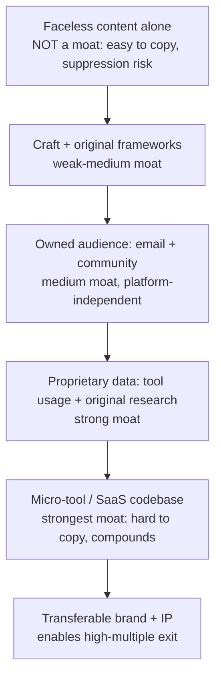

### 16.2 Why this moat strengthens over time

- The **tool** accumulates usage data and switching costs.
- The **community** gains network effects as it grows.
- The **content library + SEO** compounds in organic discovery.
- The **brand** (faceless, so transferable) becomes more valuable as recognition grows.

Content/AI production cost-advantage is *not* a durable moat (commoditizing). The software + data + owned audience are.

---

## 17. Legal, Risk, Anonymity & Compliance

> This chapter flags risks; it is not legal advice. Confirm specifics with a qualified attorney, especially around IP and any financial-content regulation.

### 17.1 Copyright & sourcing (highest content risk)

| Risk | Mitigation |
|---|---|
| TED talks are CC BY-NC-ND (No Derivatives, Non-Commercial) | Use only as research/trend input; never reformulate; build original frameworks from primary sources |
| Reformulating any copyrighted talk/article = infringing derivative | Triangulate ≥3 sources; restructure into own framework; keep a per-unit source log |
| Content-ID / copyright claims → demonetization/termination | No third-party footage/audio without license; original or properly licensed assets only |
| Quoting sources | Short, attributed, as commentary (fair-use posture), never as the substance |

### 17.2 Platform / AI-content risk

| Risk | Mitigation |
|---|---|
| YouTube/others suppress mass-produced/undisclosed-AI content | High-craft faceless ≠ low-effort AI; human-in-the-loop on script + edit; original framework/data per video; disclose AI use where required |
| Single-platform dependency | Prioritize owned email + blog; diversify across YouTube/Shorts/TikTok/IG |
| Monetization-policy changes | Don't rely on ad revenue; products + tool are primary |

### 17.3 Employment / IP (confirmed allowed, but hygiene matters)

| Risk | Mitigation |
|---|---|
| Side-project IP disputes | Operator confirms contract permits this; keep work strictly on personal time/equipment; retain records |
| Identity exposure conflicting with job | Operate pseudonymously under the brand; separate accounts/payment entity where lawful |

### 17.4 Financial-content regulation (finance pillar)

| Risk | Mitigation |
|---|---|
| Personalized financial advice may be regulated | Teach **frameworks and concepts only**; never recommend specific securities/actions; include "educational, not advice" disclaimers |

### 17.5 Anonymity / business structure

- Operate under a **brand entity** (consider an LLC or local equivalent) for contracts, payments, and to hold IP — improves both anonymity and sellability.
- Use brand-domain email, brand payment processor account, and avoid linking personal identity in public metadata.
- Holding IP in an entity makes a future **sale clean** (you sell the entity/assets, not yourself).

### 17.6 Risk register (summary)

| Risk | Likelihood | Impact | Priority |
|---|---|---|---|
| Platform suppression/demonetization | Med-High | High | P1 |
| Copyright claim from bad sourcing | Med (if process ignored) | High | P1 |
| Founder time bottleneck | High | Med | P1 |
| Saturation / failure to differentiate | Med | High | P2 |
| Tool build over-runs time/budget | Med | Med | P2 |
| Financial-content compliance | Low-Med | Med | P2 |
| Single-channel dependency | Med | High | P1 |

---

## 18. Organization & Hiring

### 18.1 Operating model

Solo founder + a bench of **remote, async contractors** (protects anonymity and day-job time). No full-time employees until the tool justifies it.

### 18.2 Hiring sequence

| When | Role | Why | Type |
|---|---|---|---|
| Month 1–2 | Video editor | Founder time is the bottleneck, not money | contractor |
| Month 4–6 | VA / ops | publishing, scheduling, admin | contractor |
| Month 9–12 | Developer help (tool) | build/maintain micro-tool | contractor |
| Year 2 | Growth/SEO contractor | scale organic + paid | contractor |
| Year 2–3 | Content lead (can carry production without founder) | makes the business transferable/sellable | contractor → key hire |

### 18.3 Documentation = sellability

Every SOP and workflow is documented from day one. A documented, contractor-run operation with a faceless brand is the most sellable possible configuration.

---

## 19. Execution Roadmap

### 19.1 30-day plan

| Week | Milestone |
|---|---|
| 1 | Finalize brand name, visual system, ElevenLabs voice; register entity/domain |
| 1 | Stand up YouTube, Beehiiv newsletter, SEO blog, Gumroad |
| 2 | Build n8n research + atomization pipeline; build script/brand-voice prompt library |
| 2 | Run research engine on 5 pillar themes; validate demand; pick 4 |
| 3 | Produce + publish first 2 flagship videos + atomized clips |
| 4 | Produce + publish next 2 flagships; ship first $20–50 template/ebook tied to best performer |

KPIs: 4 flagships live, first product live, newsletter signup flow working, pipeline operational.

### 19.2 90-day plan

- 10–12 flagships published; newsletter ~1,000 subs.
- First product validated (≥ some paying customers); decide best-selling pillar.
- Spec the micro-tool (AI pillar).
- Hire editor; raise craft bar to mitigate suppression risk.

### 19.3 180-day plan

- Strong product sales or course launched; tool beta live.
- ~5,000 subs; SEO beginning to compound.
- VA onboarded; founder time focused on strategy + QC + tool.

### 19.4 1-year plan

- Revenue ~$70k (base); course + community live; tool paying.
- Recurring revenue established; owned audience prioritized.
- Business documented and partly delegable.

### 19.5 3-year plan

- Revenue ~$1.15M (base); micro-tool at meaningful ARR.
- Contractor team; founder largely removable from production.
- Decision point: keep cash-flowing or prepare for sale (faceless = clean exit).

---

## 20. KPIs & Dashboards

### 20.1 North-star metric

**Owned-audience monetized value** = (email subscribers × revenue per subscriber) + recurring ARR (community + tool). This captures the transferable asset, not vanity reach.

### 20.2 KPI tree

| Layer | KPI | Target trajectory |
|---|---|---|
| Reach | YouTube watch time, Shorts views | grow weekly |
| Acquisition | Newsletter signups, signup rate | ≥ steady weekly growth |
| Authority | Organic search sessions, returning viewers | compounding |
| Conversion | Product conversion %, $/subscriber | improve quarterly |
| Recurring | Community MRR, tool MRR/ARR, churn | grow MRR, churn < target |
| Efficiency | Cost per content unit, founder hrs/flagship | decrease over time |
| Risk | % revenue from single platform | decrease toward diversified |

### 20.3 Review cadence

- **Weekly:** content performance, signup growth, which atomized units won (feeds idea engine).
- **Monthly:** revenue by line, conversion, churn, cost per unit.
- **Quarterly:** strategy, SEO refresh, product roadmap, tool progress, exit-readiness.

---

## 21. Final Recommendation

1. **Highest-probability path:** a faceless, brand-fronted content engine (MITMonk-style) in the wealth/productivity/self-improvement niche for mid-career professionals, funneling into a digital-product ladder that culminates in a niche AI micro-tool. Content is marketing; products + owned audience + tool are the sellable asset.
2. **Optimal content style:** high-craft motion-graphic + screen-demo explainers, one consistent AI brand voice, original framework + data per video. Avoid low-effort AI-voice-over-stock.
3. **Optimal platform mix:** YouTube (hub) + owned newsletter + SEO blog; atomize to Shorts/TikTok/IG/X/Pinterest. Skip LinkedIn.
4. **Optimal monetization sequence:** templates/ebooks → flagship course → book + community → micro-tool. Ads/affiliate/sponsorship as byproducts. No face-dependent revenue.
5. **Optimal AI stack:** Professional tier + self-hosted n8n + your own tool codebase (the two hardest-to-copy investments).
6. **Optimal hiring sequence:** editor (early) → VA/ops → developer for tool → growth contractor → delegable content lead. All async/anonymous.
7. **Optimal growth strategy:** SEO + YouTube search + product-led growth (free tool tier as viral loop). Compensate for no on-camera collabs with integrations, partnerships, and SEO.
8. **Fastest route to $100k/year:** stack digital products + course + community + ad/affiliate byproducts; ~12–18 months part-time, faster if full-time.
9. **Fastest route to $1M/year:** scale the micro-tool to ~$500k+ ARR (product-led, high-margin) + course + community + products; ~24–36 months.
10. **Path to $10M+:** grow the tool to ~$1–2M ARR with strong retention and proprietary data, keep the brand fully transferable (trivial — no face to replace), then sell at a high multiple or raise against it. **The faceless constraint is what makes a large exit *more* achievable, not less.**

### Non-negotiables (the four things that make or break this)

1. **Sourcing discipline** — TED/others as research only; original frameworks from primary sources; per-unit source log. (Legal survival.)
2. **Craft bar** — original framework + data per video; human-in-the-loop. (Demonetization survival.)
3. **Owned audience first** — email/blog over platform reach. (Independence + sellability.)
4. **Build the tool** — the AI micro-tool is the asset; everything else funds and feeds it. (Enterprise value.)

---

## Appendix A — Glossary

- **Atomization:** breaking one flagship video into many platform-native units.
- **Flagship:** the weekly long-form video that seeds all other content.
- **Owned audience:** email + community (platform-independent).
- **Micro-tool / micro-SaaS:** a small, focused software product sold (often by subscription).
- **CC BY-NC-ND:** Creative Commons license — Attribution, Non-Commercial, No Derivatives.

## Appendix B — Open Decisions Log

| # | Decision | Options | Owner | Status |
|---|---|---|---|---|
| 1 | Final brand name | Second Mind / The Leverage Lab / others | Founder | open |
| 2 | Spearhead AI tool concept | (depends on validated pillar) | Founder | open (decide by month 3) |
| 3 | Entity/jurisdiction for IP holding | LLC or local equivalent | Founder + attorney | open |
| 4 | Course platform | Skool / Teachable / custom | Founder | open |
| 5 | First product (which pillar) | learning / time / AI | Founder | decide after first 4 flagships |

## Appendix C — Assumptions Register

- Market sizes are directional estimates, not cited figures.
- Founder commits ~6–10 hrs/week year 1; scales later.
- Contract permits the side business (operator-confirmed).
- Financial figures are scenario estimates, not forecasts.
- English-language global market.
- One editor contractor from month 1–2; further contractors per hiring plan.
