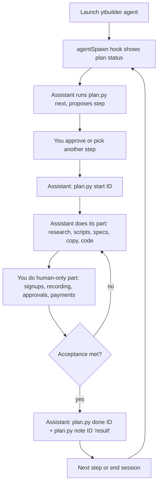

# TIMEPLAN_GUIDE.md — How we build this business together in kiro-cli

This explains the interactive system that lets this chat (kiro-cli + Claude Sonnet) and you
jointly execute the business plan across many sessions.

## What model
Run `/model` to see/select your model. You mentioned "Claude Sonnet 4.6" — pick the current
Sonnet from the list (exact version names are shown by `/model`).

## The three pieces

| File | Role |
|---|---|
| `strategy/BUSINESS_PLAN.md` | The strategy (the "why" and "what"). |
| `strategy/TIMEPLAN.yaml` | The execution state — every step, its status, dependencies, and notes. Source of truth. |
| `strategy/plan.py` | The safe interface to the plan. We change state only through this. |
| `.kiro/agents/ytbuilder.json` | A custom agent that auto-loads the two docs and shows progress every time it starts. |

## One-time setup

```bash
# from the repo root: ~/YTchannel
pip install pyyaml                 # plan.py needs this
kiro-cli settings chat.enableKnowledge true   # if not already on (knowledge base)
# (optional) make ytbuilder your default agent:
# kiro-cli agent set-default ytbuilder   # or use /agent set-default ytbuilder in chat
```

## Starting a work session

```bash
cd ~/YTchannel
kiro-cli chat --agent ytbuilder      # or: launch chat, then /agent swap ytbuilder
```

On spawn, the agent's `agentSpawn` hook runs `plan.py status`, so the assistant immediately
sees: progress, what's in progress, what's blocked, and what's ready to start. Just say
**"continue"** and the assistant proposes and starts the next step. Or name a step, e.g.
**"let's do P1-03"**.

## The interaction loop (each step)



## plan.py commands (what the assistant uses)

| Command | Purpose |
|---|---|
| `python3 strategy/plan.py status` | summary + in-progress + ready-to-start |
| `python3 strategy/plan.py next` | the single recommended next step + how/acceptance |
| `python3 strategy/plan.py list [--phase P1]` | all steps, optionally by phase |
| `python3 strategy/plan.py show P1-03` | full detail for one step |
| `python3 strategy/plan.py start P1-03` | mark in progress (blocks if deps unmet) |
| `python3 strategy/plan.py done P1-03` | mark done (blocks if deps unmet); shows unlocked steps |
| `python3 strategy/plan.py block P1-03 "waiting on domain"` | mark blocked with reason |
| `python3 strategy/plan.py unblock P1-03` | back to todo |
| `python3 strategy/plan.py note P1-03 "chose Beehiiv"` | append a timestamped note |
| `python3 strategy/plan.py progress` | one-line progress bar |

Dependencies are enforced: you cannot `start`/`done` a step whose prerequisites aren't done.
This keeps the plan honest across sessions.

## Division of labor (default)

- **Assistant does:** research-engine runs, drafting scripts in brand voice, building prompt
  libraries, designing n8n flows + node configs, writing landing/sales/email copy, course
  curricula, the book draft, pair-programming the micro-tool, analytics analysis, updating plan state.
- **You do:** account signups, anything needing your face/identity is out of scope by design,
  final approvals, payments, hiring decisions, legal/financial sign-off, deploying infrastructure
  you control.

## The two non-negotiables (the assistant will enforce)

1. **Sourcing discipline:** TED and other copyrighted talks are *research/trend input only*.
   Never reformulate them. Every content unit = original framework from >=3 primary sources,
   with a source log. (Legal survival.)
2. **Craft bar:** every video has an original framework + an original data point/example, with
   a human in the loop on script and edit. (Demonetization survival.)

## Why this design (and not an MCP server)

A custom MCP server would add a running process and protocol to maintain for state that is
just "which steps are done." This YAML + plan.py + agent design is:
- **Inspectable** — plain text you can read and edit if needed.
- **Durable** — survives kiro-cli upgrades; no server to keep alive.
- **Active** — the `agentSpawn` hook means every session auto-loads state, satisfying the
  "chat actively interfaces with the time plan" requirement.

If we later outgrow this (e.g., multiple collaborators, a web dashboard), we can wrap plan.py
in an MCP server with the same commands — the interface stays identical.

## Resetting / adding steps

Add or change steps by editing `TIMEPLAN.yaml` following the schema documented at the top of
that file, then run `python3 strategy/plan.py status` to confirm it still parses. Ask the
assistant to do this for you.
